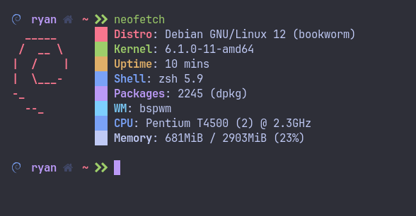
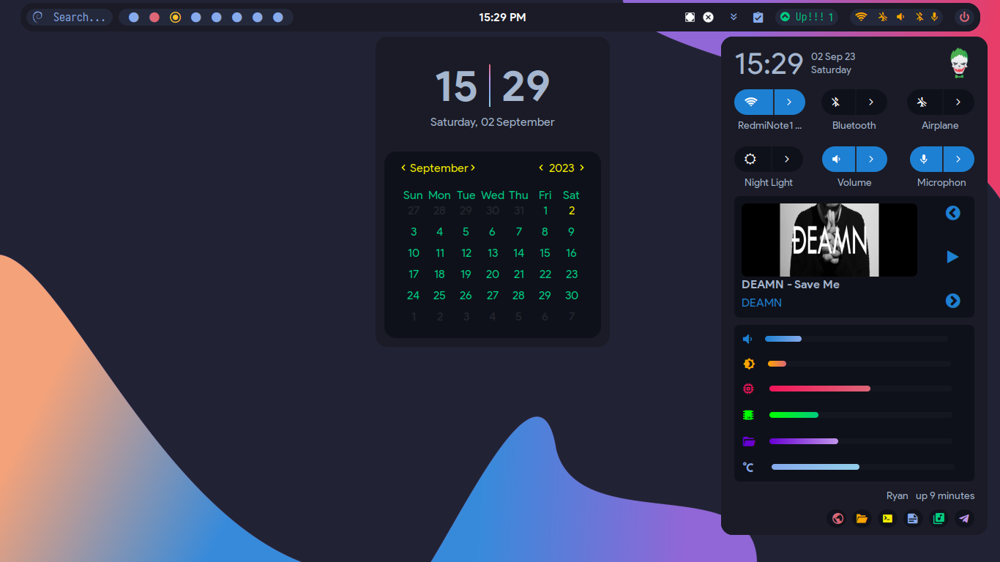
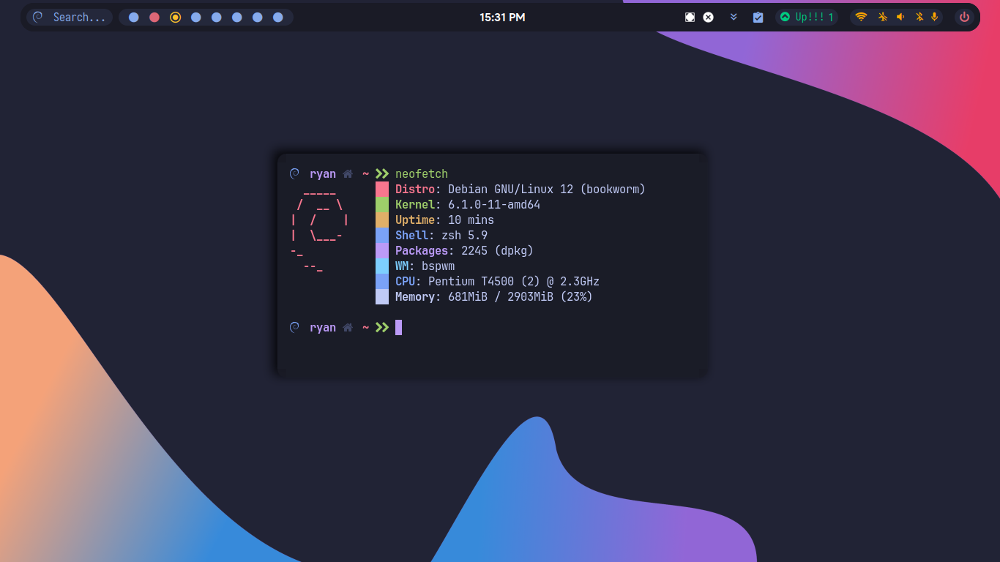
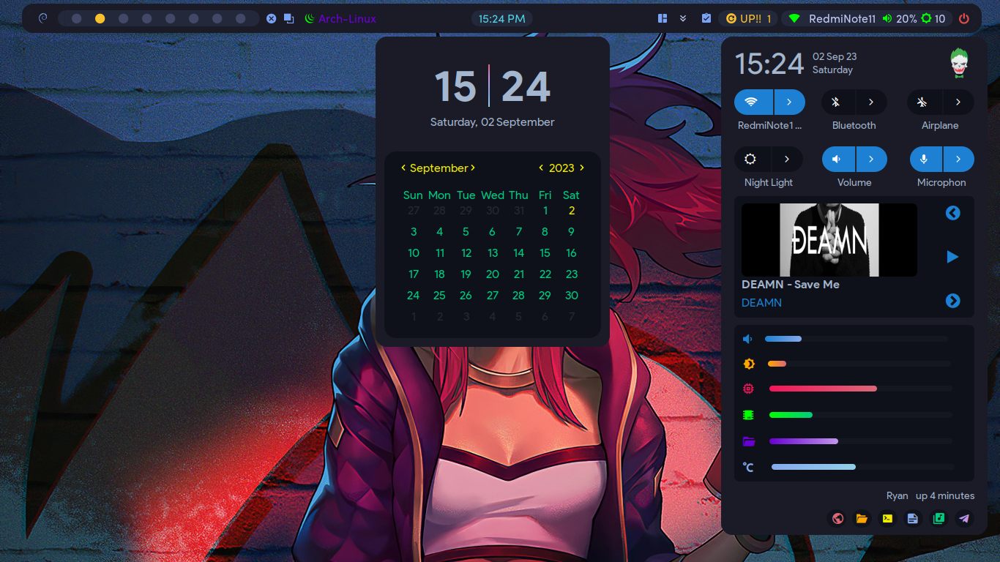
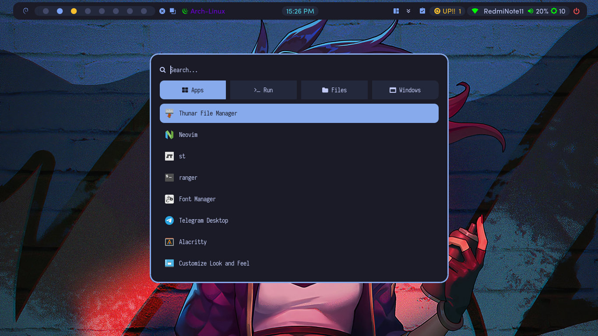
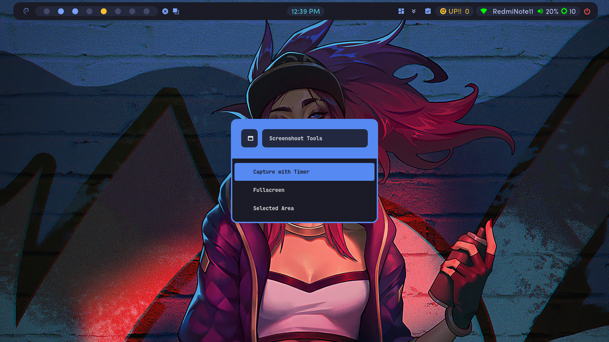

# dotfiles-bspwm | For Debian 12

<div align=center>

<a href="https://github.com/baskerville/bspwm"></a>

<div align="center">
    
    
</div>

</div>

## 📃 Information

This Dotfiles use [Polybar](https://github.com/polybar/polybar) and [EWW/ElKowars wacky widgets](https://github.com/elkowar/eww) as bar. You can change the bar using Polybar or EWW.



|    Distro    |                        [Debian 12](https://debian.org/)                        |
| :----------: | :----------------------------------------------------------------------------: |
|      WM      |                 [BSPWM](https://github.com/baskerville/bspwm)                  |
|   Terminal   |              [Alacritty](https://github.com/alacritty/alacritty)               |
|   Widgets    |            [ElKowars wacky widgets](https://github.com/elkowar/eww)            |
|    Shell     |                [Oh My Zsh](https://github.com/ohmyzsh/ohmyzsh)                 |
|   Launcher   |                   [Rofi](https://github.com/davatorium/rofi)                   |
|  Clipboard   |              [Rofi-Greenclip](https://github.com/erebe/greenclip)              |
|    Neovim    | [Neovim](https://github.com/neovim/neovim)-[Astronvim](https://astronvim.com/) |
|  Compositor  |                                     Picom                                      |
| Music/Player |                                  MPD-Ncmpcpp                                   |
| File Manager |                                     Thunar                                     |
| Notification |                                     Dunst                                      |

## ⌨️ Some Keyboard Shortcuts to know

- <code>super + space</code> Launcher Menu.
- <code>print</code> Takes Screenshot.
- <code>super + return</code> Open a terminal.
- <code>super + alt + Return</code> Open a floating terminal.
- <code>alt + c</code> Color Picker.
- <code>super + alt + w</code> Changes randomly wallpaper.
- <code>super + alt + r</code> Restart bspwm.

And more..

## 🌿 Gallery

- <code>use eww bar</code>


- <code>use eww with neofetch</code>


- <code>use polybar</code>


- <code>rofi launcher</code>


- <code>Screenshoot</code>


## 🛠️ Setup

1.- **First clone the repository**

2.- **Copy config :**

- **⚠️ WARNING: Configuration files may be overrided,please backup your config**

```sh
cd dotfiles-bspwm
cp -r config/* ~/.config/
cp -r local/* ~/.local/
cp -r home/* ~/
```

3.- **This dependecies only works for Debian 12 and based distro, for other distro you can search same packages**

```sh
sudo apt install xorg bspwm polybar sxhkd alacritty brightnessctl dunst rofi jq policykit-1-gnome git playerctl mpd ncmpcpp geany ranger mpc picom xdotool feh ueberzug maim pamixer libwebp-dev xdg-user-dirs nala webp-pixbuf-loader zsh zsh-autosuggestions zsh-syntax-highlighting thunar thunar-volman thunar-archive-plugin gvfs gvfs-backends engrampa tint2 dmenu xdo jgmenu redshift xautolock fzf ytfzf yt-dlp gawk tumbler gpick neofetch xdg-utils python-is-python3 python3-gi gir1.2-nm-1.0 duf libglib2.0-bin btop ncdu bat exa wmctrl acpid xclip scrot acpi playerctl redshift mpdris2 libplayerctl-dev gir1.2-playerctl-2.0 mpv lxapperience bc
```

- **For eww**

You can extract from folder app support and copy with sudo to /usr/bin/

- **For Neovim**

Because Neovim in Debian 12 to old, you can install from folder app support or build from [Neovim](https://github.com/neovim/neovim)

- **For Fonts**

Extract fonts.zip in ~/.local/share/fonts than run fc-cache -fv in terminal

- **To change bar, from polybar to eww**

```sh
-- change this line =
eww -c "$HOME"/.config/bspwm/ryan/src/eww daemon &
polybar -q ryan-bar -c "$HOME"/.config/bspwm/ryan/config.ini &
#eww -c "$HOME"/.config/bspwm/ryan/src/eww open bar &

-- become =
#eww -c "$HOME"/.config/bspwm/ryan/src/eww daemon &
#polybar -q ryan-bar -c "$HOME"/.config/bspwm/ryan/config.ini &
eww -c "$HOME"/.config/bspwm/ryan/src/eww open bar &

-- in =
~/.config/bspwm/bspwmrc
```

- **Run MPD**

```sh
systemctl --user enable mpd
```

***
**For other you can build from sources :**

- [I3lock-Color](https://github.com/Raymo111/i3lock-color)

- [Bsp-layout](https://github.com/phenax/bsp-layout)

- [Rofi-greenclip](https://github.com/erebe/greenclip)

- [Tdrop](https://github.com/noctuid/tdrop)

- [Xqp](https://github.com/baskerville/xqp)

**For Themes and icons :**

- [Material-GTK-Themes](https://github.com/Fausto-Korpsvart/Material-GTK-Themes)

- [TokyoNight](https://github.com/ljmill/tokyo-night-icons)

<table align="center">
   <tr>
      <th align="center">
      </th>
   </tr>
   <tr>
      <td align="center">

    **Dotfiles Configured at 1360x768 with 96 DPI on 1 monitor**

   </tr>
   </table>

## Credits

[adi1090x](https://github.com/adi1090x/widgets), [gh0stzk](https://github.com/gh0stzk/dotfiles), [rxyhn](https://github.com/rxyhn/bspdots), [AlphaTechnolog](https://github.com/AlphaTechnolog), [Chick2D](https://github.com/Chick2D/neofetch-themes), [siduck](https://github.com/siduck/st), [bakkeby](https://github.com/bakkeby/dmenu-flexipatch)
